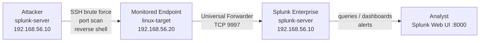
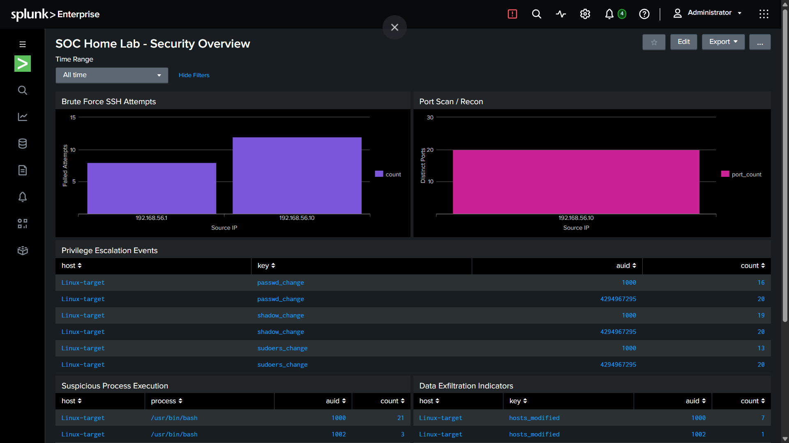
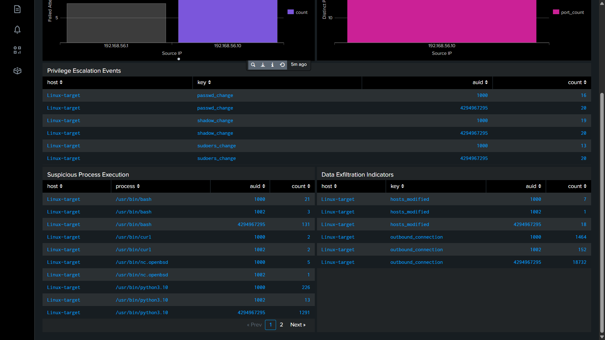
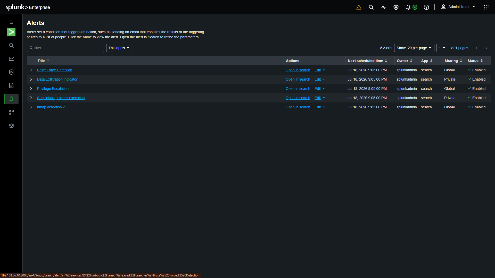

# Splunk SIEM Home Lab

A minimal, self-hosted SOC lab: an endpoint generates activity, a Universal
Forwarder ships logs to Splunk Enterprise, and five detections + a dashboard
surface simulated attacks in near real time.

Built to practice detection engineering, SPL, and incident investigation
end-to-end — from raw log source to triggered alert to dashboard.

---

## Architecture



| Component | Role | Host |
|---|---|---|
| Splunk Enterprise | SIEM — indexing, search, alerting | `splunk-server` (192.168.56.10) |
| Universal Forwarder | Log collection + forwarding agent | `linux-target` (192.168.56.20) |
| auditd | Kernel-level audit logging (syscalls, file watches) | `linux-target` |
| UFW | Host firewall — logs blocked traffic | `linux-target` |
| Hydra | SSH brute-force simulation | `splunk-server` |
| Nmap | Port scan simulation | `splunk-server` |

**Network:** Host-Only network `192.168.56.0/24`, gateway `192.168.56.1`. Each
VM also has a NAT NIC for internet access (package installs only) — all lab
traffic between the two VMs stays on the host-only subnet.

---

## Log Sources → Indexes

| Log File | Index | Sourcetype | Captures |
|---|---|---|---|
| `/var/log/auth.log` | `linux_auth` | `linux_secure` | SSH logins, sudo, authentication events |
| `/var/log/syslog` | `linux_syslog` | `syslog` | General system events |
| `/var/log/audit/audit.log` | `linux_audit` | `linux_audit` | Syscalls, file watches, privileged commands |
| `/var/log/ufw.log` | `linux_network` | `ufw` | Firewall blocks, port scan traffic |

See [`configs/`](configs/) for the exact `inputs.conf`, `outputs.conf`, and
`audit.rules` used.

---

## Detections

| # | Detection | Index | Write-up |
|---|---|---|---|
| 1 | Brute Force SSH | `linux_auth` | [detections/01-brute-force-ssh.md](detections/01-brute-force-ssh.md) |
| 2 | Port Scan / Recon | `linux_network` | [detections/02-port-scan.md](detections/02-port-scan.md) |
| 3 | Privilege Escalation | `linux_audit` | [detections/03-privilege-escalation.md](detections/03-privilege-escalation.md) |
| 4 | Suspicious Process Execution | `linux_audit` | [detections/04-suspicious-process.md](detections/04-suspicious-process.md) |
| 5 | Data Exfiltration | `linux_audit` | [detections/05-data-exfiltration.md](detections/05-data-exfiltration.md) |

All five are Scheduled alerts (every minute, searching the last 1 minute,
triggering when Number of Results > 0, severity High). Real-time alerting
was deliberately avoided — unnecessary resource overhead for a homelab at
this scale.

---

## MITRE ATT&CK Coverage

| Detection | Tactic | Technique |
|---|---|---|
| Brute Force SSH | Credential Access | [T1110.001](https://attack.mitre.org/techniques/T1110/001/) — Password Guessing |
| Port Scan / Recon | Discovery / Reconnaissance | [T1046](https://attack.mitre.org/techniques/T1046/) — Network Service Discovery, [T1595.001](https://attack.mitre.org/techniques/T1595/001/) — Scanning IP Blocks |
| Privilege Escalation | Privilege Escalation / Persistence | [T1548.003](https://attack.mitre.org/techniques/T1548/003/) — Sudo and Sudo Caching, [T1098](https://attack.mitre.org/techniques/T1098/) — Account Manipulation |
| Suspicious Process Execution | Execution / Command and Control | [T1059.004](https://attack.mitre.org/techniques/T1059/004/) — Unix Shell, [T1105](https://attack.mitre.org/techniques/T1105/) — Ingress Tool Transfer |
| Data Exfiltration | Impact / Exfiltration | [T1565.001](https://attack.mitre.org/techniques/T1565/001/) — Stored Data Manipulation, [T1048](https://attack.mitre.org/techniques/T1048/) — Exfiltration Over Alternative Protocol |

Per-detection mapping details are in each write-up under `detections/`.

---

## SOC Dashboard

**Classic Dashboard** (Simple XML), source at [`soc_dashboard.xml`](soc_dashboard.xml).

| Panel | Visualization |
|---|---|
| Brute Force SSH Attempts | Bar Chart |
| Port Scan / Recon | Bar Chart |
| Privilege Escalation Events | Table |
| Suspicious Process Execution | Table |
| Data Exfiltration Indicators | Table |

Single time-range input (default Last 24 hours) drives all five panels.





---

## Triggered Alerts

All 5 scheduled alerts firing in Splunk's Triggered Alerts view:



---

## Key Lessons Learned

- SSH in **directly as the test account** rather than `su -` into it — `su`
  preserves the original session's `auid`, so auditd attributes activity to
  the wrong user.
- The `acct` field is blank in SYSCALL records — use `auid` to identify the
  actor instead.
- `auid=4294967295` means no authenticated session (background/daemon
  process) — safe to ignore during triage.
- Splunk's `IN` operator doesn't reliably match wildcards in a multivalue
  comparison — use `where match(field, "regex")` instead.
- High-volume auditd keys (e.g. `outbound_connection`, `execve`) need a
  narrowing filter (specific `auid`, or a `match()` on the binary path) to
  stay usable — logging every syscall/connection is noisy by design.
- Splunk **Free** disables alerting entirely; this lab runs on the 60-day
  Enterprise **Trial** instead, since alerting is the point of the project.

---

## Repository Layout

```
.
├── README.md
├── soc_dashboard.xml       # Classic Dashboard Simple XML source
├── configs/
│   ├── inputs.conf         # Universal Forwarder monitor stanzas
│   ├── outputs.conf        # Forwarder → indexer config
│   └── audit.rules         # auditd rules (homelab.rules)
├── detections/
│   ├── 01-brute-force-ssh.md
│   ├── 02-port-scan.md
│   ├── 03-privilege-escalation.md
│   ├── 04-suspicious-process.md
│   └── 05-data-exfiltration.md
└── screenshots/
    ├── soc_dashboard.png
    ├── soc_dashboard_2.png
    ├── triggered_alerts.png
    ├── alert_brute_force.png
    ├── alert_port_scan.png
    ├── alert_privilege_escalation.jpg
    ├── alert_suspicious_process.jpg
    └── alert_data_exfiltration.jpg
```

---

## Credentials / Secrets

None of the actual passwords, tokens, or license keys used to build this
lab are stored in this repository. See your local, untracked notes for
credentials.
