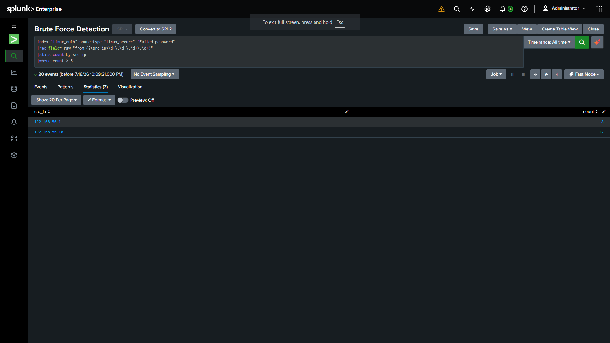

# Detection: Brute Force SSH

## Overview

Detects repeated failed SSH authentication attempts from a single source IP —
a classic indicator of a credential-guessing attack (e.g. Hydra, Medusa).

| Field | Value |
|---|---|
| Index | `linux_auth` |
| Sourcetype | `linux_secure` |
| Log source | `/var/log/auth.log` |

## MITRE ATT&CK Mapping

| Tactic | Technique | ID |
|---|---|---|
| Credential Access | Brute Force: Password Guessing | [T1110.001](https://attack.mitre.org/techniques/T1110/001/) |

## Attack Simulation

**Tool:** `hydra`

```bash
hydra -l testuser -P /usr/share/wordlists/rockyou.txt ssh://192.168.56.20
```

## Detection Logic

**Hypothesis:** An attacker trying many passwords in a short window will
generate a high volume of "Failed password" events from one source IP.

```spl
index=linux_auth sourcetype=linux_secure "Failed password"
| rex field=_raw "from (?<src_ip>\d+\.\d+\.\d+\.\d+)"
| stats count by src_ip
| where count > 5
```

**Trigger threshold:** Failed password count > 5 from a single source IP.

## Alert Configuration

| Field | Value |
|---|---|
| Alert Type | Scheduled |
| Schedule | Every minute, search over Last 1 minute |
| Trigger when | Number of Results > 0 |
| Severity | High |
| Action | Add to Triggered Alerts |

## Screenshot



## Notes

- No unusual lessons here beyond the general ones in the main README —
  standard `auth.log` parsing worked as expected.
