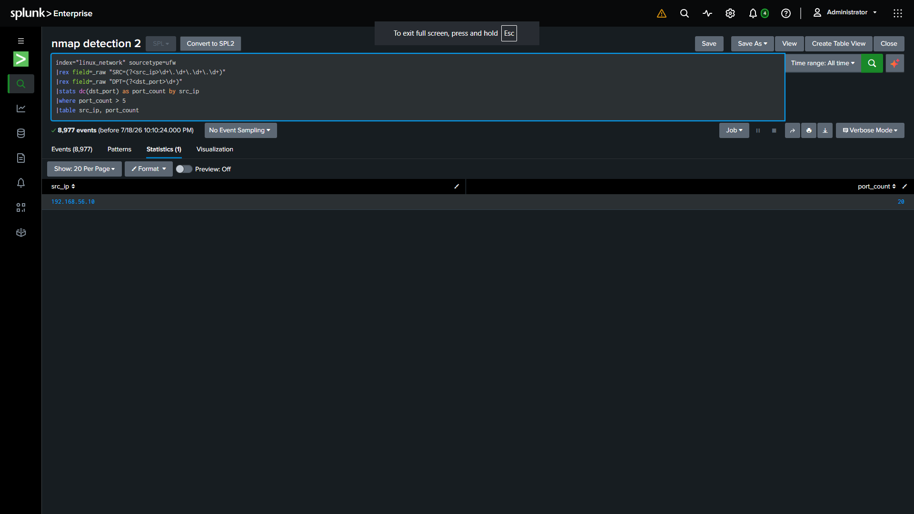

# Detection: Port Scan / Recon

## Overview

Detects a single source IP touching an unusually large number of distinct
destination ports in a short window — indicative of network reconnaissance
(e.g. Nmap SYN scan).

| Field | Value |
|---|---|
| Index | `linux_network` |
| Sourcetype | `ufw` |
| Log source | `/var/log/ufw.log` |

## MITRE ATT&CK Mapping

| Tactic | Technique | ID |
|---|---|---|
| Discovery | Network Service Discovery | [T1046](https://attack.mitre.org/techniques/T1046/) |
| Reconnaissance | Active Scanning: Scanning IP Blocks | [T1595.001](https://attack.mitre.org/techniques/T1595/001/) |

## Attack Simulation

**Tool:** `nmap`

```bash
nmap -sS -p 1-1000 192.168.56.20
```

## Detection Logic

**Hypothesis:** A scanner will generate blocked/logged connection attempts
against many distinct ports from one source IP.

```spl
index=linux_network sourcetype=ufw
| rex field=_raw "SRC=(?<src_ip>\d+\.\d+\.\d+\.\d+) DST=(?<dst_ip>\d+\.\d+\.\d+\.\d+) .* DPT=(?<dst_port>\d+)"
| stats dc(dst_port) as port_count by src_ip
| where port_count > 15
```

**Trigger threshold:** More than 15 distinct destination ports from a single source IP.

## Alert Configuration

| Field | Value |
|---|---|
| Alert Type | Scheduled |
| Schedule | Every minute, search over Last 1 minute |
| Trigger when | Number of Results > 0 |
| Severity | High |
| Action | Add to Triggered Alerts |

## Screenshot



## Notes

- UFW must be logging (`sudo ufw logging on`) and enabled, with SSH explicitly
  allowed first (`sudo ufw allow 22/tcp`) to avoid locking yourself out before
  enabling the firewall.
