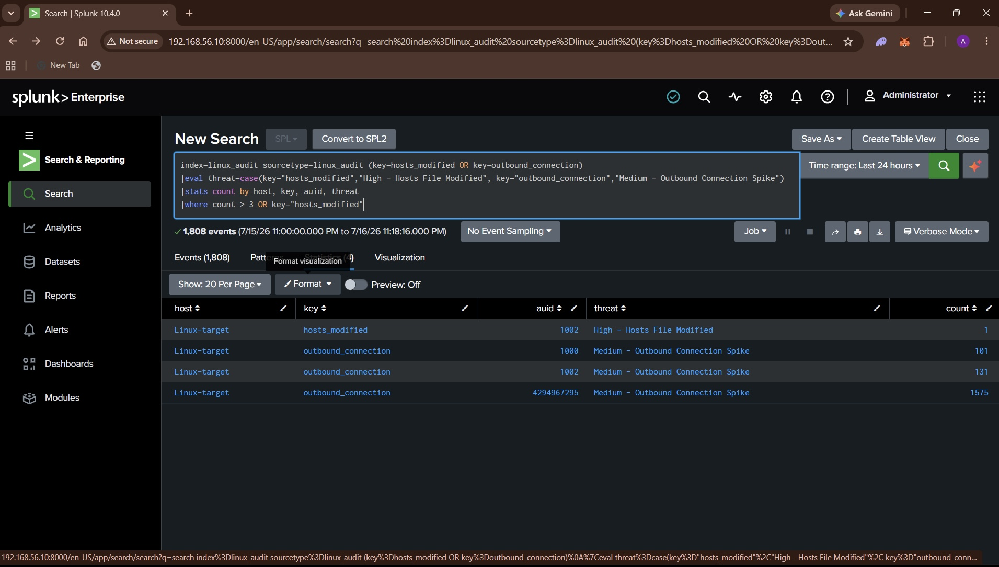

# Detection: Data Exfiltration

## Overview

Detects two combined indicators of staged exfiltration: modification of
`/etc/hosts` (often used to redirect traffic to an attacker-controlled
domain) and a burst of outbound connections from the same account.

| Field | Value |
|---|---|
| Index | `linux_audit` |
| Sourcetype | `linux_audit` |
| Log source | `/var/log/audit/audit.log` |
| auditd keys | `hosts_modified`, `outbound_connection` |

## Attack Simulation

```bash
echo "1.2.3.4 exfil.evil.com" | sudo tee -a /etc/hosts
curl http://exfil.evil.com/   # repeated several times
```

`testuser` needs sudo access for this simulation:
```bash
sudo usermod -aG sudo testuser
```

## Detection Logic

**Hypothesis:** A hosts-file rewrite paired with repeated outbound
connections from the same user is a plausible exfil staging pattern.

```spl
index=linux_audit sourcetype=linux_audit (key=hosts_modified OR key=outbound_connection)
| stats count by host, key, auid
| where count > 3 OR key="hosts_modified"
```

**Trigger threshold:** More than 3 outbound connection events, OR any
`hosts_modified` event (zero-tolerance on hosts-file writes).

## Alert Configuration

| Field | Value |
|---|---|
| Alert Type | Scheduled |
| Schedule | Every minute, search over Last 1 minute |
| Trigger when | Number of Results > 0 |
| Severity | High |
| Action | Add to Triggered Alerts |

## Screenshot



## Notes

- `outbound_connection` alone generates high event volume (1700+ events)
  from normal system background connections — filter by `auid=1002`
  (testuser) when triaging manually to isolate simulated activity from
  system noise.
